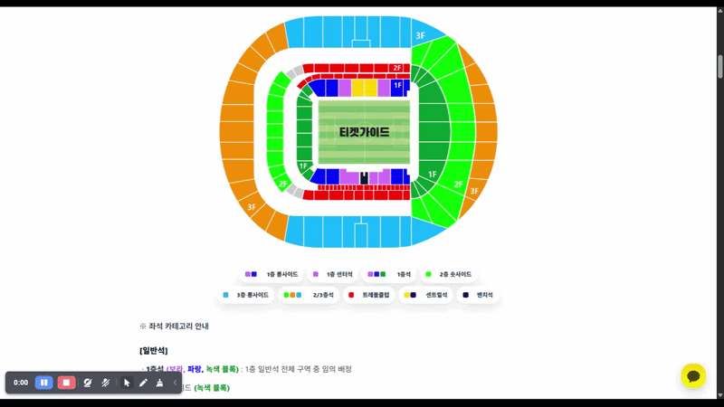
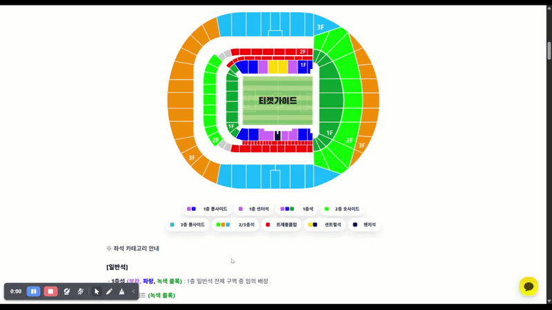
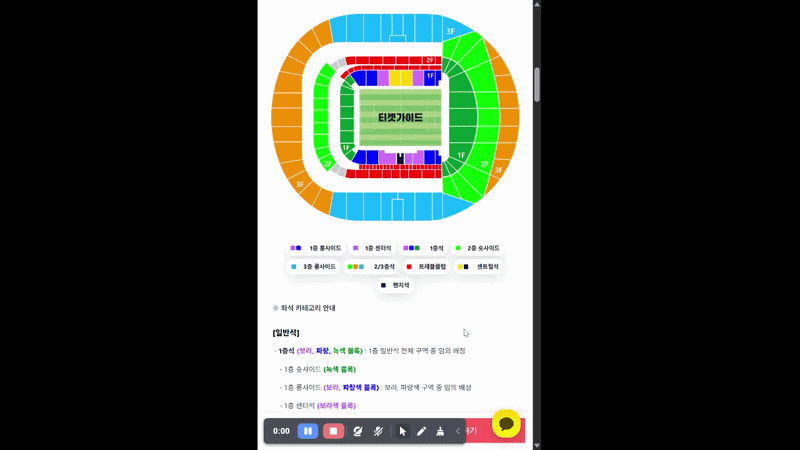

# Interactive Stadium Seat Map

> 스포츠 경기 티켓 상품 페이지를 위한 **반응형 인터랙티브 좌석 안내 UI**

정적인 경기장 좌석 이미지 위에 선택 영역을 구현해, 사용자가 좌석의 위치와 특징을 직관적으로 확인할 수 있도록 제작한 외주 프로젝트입니다.

운영 페이지에 바로 코드를 작성하지 않고 **CodePen에서 UI와 인터랙션을 먼저 검증**한 뒤, 아임웹의 커스텀 HTML환경 그리고 관리자 페이지에 있는 CSS·JavaScript SEO 환경을 적용했습니다. 유럽·미국 축구 경기장과 일본 야구장을 포함해 **총 30개 상품 페이지**를 제작했습니다.

<br>

## Tech Stack

<div align="center">


</div>

## Preview

### PC — 좌석 영역 탐색



### PC — 좌석 범례 연동



### Mobile — 좌석 정보 바텀시트



[Live Service](https://www.ticketguide.co.kr/shop_view?idx=27#prod_detail_detail)

<br>

## Project Overview

| 항목 | 내용 |
| --- | --- |
| 프로젝트 유형 | 외주 프로젝트 |
| 담당 역할 | 프론트엔드 UI 개발 및 아임웹 적용 |
| 적용 규모 | 축구·야구 경기장 상품 페이지 30개 |
| 개발 방식 | CodePen 프로토타이핑 → 아임웹 운영 환경 적용 |
| 기술 | HTML5, CSS3, Vanilla JavaScript, CodePen, Imweb |
| 지원 환경 | Desktop, Mobile |

<br>

## Background

기존 상품 페이지는 정적인 좌석 이미지와 텍스트 설명만 제공해 사용자가 다음 정보를 빠르게 파악하기 어려웠습니다.

- 선택하려는 좌석이 경기장 내 어느 위치인지
- 좌석 등급별 시야와 특징이 무엇인지
- 동일한 카테고리에 포함된 좌석 구역이 어디인지
- 모바일 환경에서 좌석 정보를 어떻게 확인해야 하는지

이를 개선하기 위해 사용자가 좌석 이미지와 범례를 직접 탐색하며 정보를 확인할 수 있는 인터랙티브 좌석 안내 UI를 구현했습니다.

<br>

## Key Features

### 1. 이미지 위 좌석 선택 영역

- 경기장 이미지 위에 `position: absolute` 기반의 투명 오버레이 배치
- 좌석 위치를 퍼센트 좌표로 지정해 이미지 크기 변화에 대응
- `clip-path: polygon()`을 사용해 사각형이 아닌 실제 좌석 블록 형태 구현
- 하나의 카테고리에 속한 여러 좌석 구역을 그룹으로 연결

### 2. Desktop Interaction

- 좌석 및 범례에 마우스를 올리면 관련 구역을 동시에 하이라이트
- 마우스 위치를 따라 이동하는 좌석 정보 툴팁 제공
- 브라우저 경계를 계산해 툴팁이 화면 밖으로 벗어나지 않도록 위치 보정
- 선택되지 않은 범례를 흐리게 처리해 현재 선택 상태를 명확하게 표현

### 3. Mobile Interaction

- 좌석 또는 범례를 탭하면 화면 하단에 바텀시트 표시
- 좌석명, 설명, 추천 포인트 등 상세 정보 제공
- 닫기 버튼과 백드롭을 이용한 종료 처리
- 모바일 화면 크기에 맞춘 반응형 레이아웃 구성

### 4. Accessibility

- 좌석 영역에 `tabindex`를 적용해 키보드 포커스 지원
- 화면에 보이지 않는 좌석 영역에도 의미 있는 텍스트 제공
- `ESC` 키를 이용한 툴팁 및 바텀시트 종료
- 닫기 버튼에 접근 가능한 레이블 적용

### 5. 아임웹 환경 대응

- 아임웹에서 제공이 안되는 HTML 태그가 있는지 사전에 조사한 후 코드 작성
- 페이지별 고유 ID와 클래스 접두사를 사용해 기존 스타일과의 충돌 방지
- IIFE를 이용해 JavaScript 변수와 실행 범위 분리

<br>

## Implementation Highlights

### 비정형 좌석 영역 구현

경기장 좌석 구역은 일반적인 사각형 형태가 아니기 때문에 `clip-path`로 실제 블록과 비슷한 선택 영역을 만들었습니다.

```css
.seat-zone {
  position: absolute;
  cursor: pointer;
  opacity: 0;
  pointer-events: auto;
}

.seat-zone.is-active {
  opacity: 1;
  background-color: var(--zone-color);
  mix-blend-mode: multiply;
}

.seat-zone--longside {
  left: 16.85%;
  top: 28.61%;
  width: 22.59%;
  height: 12.96%;
  clip-path: polygon(
    99.6% 0%,
    53.7% 0.7%,
    31.6% 13.6%,
    10.7% 46.4%,
    0% 99.3%,
    99.6% 56.4%
  );
}
```

### 좌석 데이터와 화면 정보 연결

좌석 카테고리별 정보를 JavaScript 객체로 관리하고, 사용자가 선택한 좌석에 맞춰 툴팁 또는 바텀시트 내용을 변경했습니다.

```javascript
const seatData = {
  firstLongside: {
    name: "1층 롱사이드",
    subtitle: "선수들을 가까이에서 볼 수 있는 좌석",
    color: "#F28A00",
    description: "현장감과 근접 관람을 중요하게 보는 사용자에게 적합합니다.",
    feature: "근접 관람"
  }
};
```

### PC와 모바일의 인터랙션 분리

PC에서는 `mouseover`, `mousemove`를 이용한 툴팁을 제공하고, hover가 없는 모바일에서는 `click` 기반의 바텀시트를 제공했습니다.

```javascript
const mobileQuery = window.matchMedia("(max-width: 768px)");

function isMobile() {
  return mobileQuery.matches;
}
```

<br>

## Development Process

```text
좌석 이미지 및 카테고리 분석
        ↓
CodePen에서 좌표·clip-path 실험
        ↓
PC hover 및 툴팁 구현
        ↓
모바일 탭 및 바텀시트 구현
        ↓
아임웹 커스텀 코드 영역에 적용
        ↓
실제 상품 페이지에서 반응형·충돌 테스트
        ↓
경기장별 좌석 구조에 맞춰 확장
```

### CodePen을 사용한 이유

아임웹 운영 페이지에 코드를 직접 수정하면 기존 상품 페이지에 영향을 줄 수 있기 때문에, CodePen에서 다음 항목을 먼저 검증했습니다.

- 좌석 오버레이의 위치와 크기
- `clip-path` 좌표
- 좌석 그룹 하이라이트
- 툴팁 위치와 화면 경계 처리
- 모바일 바텀시트 동작
- 반응형 레이아웃

검증이 끝난 코드를 경기장별 고유 네임스페이스로 변경한 뒤 운영 페이지에 적용했습니다.

<br>

## My Role

- 경기장별 좌석 이미지와 좌석 카테고리 분석
- 좌석 오버레이의 위치·크기·다각형 좌표 설계
- CodePen 기반 프로토타입 제작 및 기능 검증
- HTML·CSS·Vanilla JavaScript 인터랙션 개발
- PC 툴팁 및 모바일 바텀시트 구현
- 좌석 영역과 범례의 양방향 상태 연동
- 아임웹 커스텀 코드 환경 적용
- PC·모바일 반응형 및 실제 페이지 동작 테스트
- 경기장별 UI 커스터마이징 및 페이지 확장

<br>

## Results

- 축구 및 야구 경기장 상품 페이지 **총 30개 제작**
- 정적인 좌석 이미지를 탐색 가능한 인터랙티브 UI로 개선
- PC와 모바일 환경에 각각 적합한 정보 제공 방식 구현
- CodePen 프로토타입을 실제 아임웹 운영 환경으로 이식
- 경기장별로 다른 좌석 구조와 상품 카테고리에 대응

<br>

## Live Pages

실제 아임웹 상품 페이지에 적용된 결과물입니다.  
각 페이지는 경기장별 좌석 구조와 상품 카테고리에 맞춰 개별 커스터마이징했습니다.

> 실제 서비스 운영 상황에 따라 페이지 내용이나 URL이 변경될 수 있습니다.

### Baseball

| No. | 경기장·팀 | 결과물 |
| :---: | --- | :---: |
| 01 | 한신 타이거스 · 고시엔 구장 | [페이지 보기](https://www.ticketguide.co.kr/shop_view?idx=81) |
| 02 | 교세라 돔 오사카 | [페이지 보기](https://www.ticketguide.co.kr/shop_view?idx=82) |
| 03 | 도쿄 돔 | [페이지 보기](https://www.ticketguide.co.kr/shop_view?idx=80) |

### Football

| No. | 경기장·팀 | 결과물 |
| :---: | --- | :---: |
| 04 | 파리 생제르맹 | [페이지 보기](https://www.ticketguide.co.kr/shop_view?idx=25) |
| 05 | 바이에른 뮌헨 | [페이지 보기](https://www.ticketguide.co.kr/shop_view?idx=40) |
| 06 | 첼시 | [페이지 보기](https://www.ticketguide.co.kr/shop_view?idx=29) |
| 07 | SSC 나폴리 | [페이지 보기](https://www.ticketguide.co.kr/shop_view?idx=71) |
| 08 | AC 밀란 | [페이지 보기](https://www.ticketguide.co.kr/shop_view?idx=37) |
| 09 | 인테르 밀란 | [Updated to New One] |
| 10 | AS 로마 | [페이지 보기](https://www.ticketguide.co.kr/shop_view?idx=69) |
| 11 | 라치오 | [페이지 보기](https://www.ticketguide.co.kr/shop_view?idx=41) |
| 12 | 피오렌티나 | [페이지 보기](https://www.ticketguide.co.kr/shop_view?idx=72) |
| 13 | 리버풀 | [페이지 보기](https://www.ticketguide.co.kr/shop_view?idx=31) |
| 14 | 맨체스터 시티 | [페이지 보기](https://www.ticketguide.co.kr/shop_view?idx=20) |
| 15 | 맨체스터 유나이티드 | [페이지 보기](https://www.ticketguide.co.kr/shop_view?idx=21) |
| 16 | 아스날 | [페이지 보기](https://www.ticketguide.co.kr/shop_view?idx=30) |
| 17 | 토트넘 홋스퍼 | [페이지 보기](https://www.ticketguide.co.kr/shop_view?idx=27) |
| 18 | 크리스털 팰리스 | [페이지 보기](https://www.ticketguide.co.kr/shop_view?idx=36) |
| 19 | 브라이턴 | [페이지 보기](https://www.ticketguide.co.kr/shop_view?idx=42) |
| 20 | 풀럼 | [페이지 보기](https://www.ticketguide.co.kr/shop_view?idx=39) |
| 21 | 브렌트퍼드 | [페이지 보기](https://www.ticketguide.co.kr/shop_view?idx=55) |
| 22 | 마인츠 05 | [페이지 보기](https://www.ticketguide.co.kr/shop_view?idx=33) |
| 23 | 아틀레티코 마드리드 | [페이지 보기](https://www.ticketguide.co.kr/shop_view?idx=34) |
| 24 | FC 바르셀로나 | [페이지 보기](https://www.ticketguide.co.kr/shop_view?idx=28) |
| 25 | 레알 마드리드 | [페이지 보기](https://www.ticketguide.co.kr/shop_view?idx=24) |
| 26 | 세비야 FC | [페이지 보기](https://www.ticketguide.co.kr/shop_view?idx=44) |
| 27 | 에스파뇰 | [페이지 보기](https://www.ticketguide.co.kr/shop_view?idx=73) |
| 28 | LAFC | [페이지 보기](https://www.ticketguide.co.kr/shop_view?idx=70) |
| 29 | 인테르 밀란 — 신규 버전 | [페이지 보기](https://www.ticketguide.co.kr/shop_view?idx=68) |
| 30 | AC 밀란 — 신규 버전 | [페이지 보기](https://www.ticketguide.co.kr/shop_view?idx=37) |

<br>

## Project Structure

각 경기장 페이지는 아임웹에 개별 적용하기 쉽도록 HTML, CSS, JavaScript와 좌석 이미지로 구성했습니다.

```text
imweb/
├── assets/
│   └── stadium-images/
│
├── stadium-page-01/
│   ├── seat-map.html
│   ├── seat-map.css
│   ├── seat-map.js
│   └── seat-map.png
│
├── stadium-page-02/
│   ├── seat-map.html
│   ├── seat-map.css
│   ├── seat-map.js
│   └── seat-map.png
│
└── ... 30 pages
```

<br>

## Current Status

현재 코드는 외주 일정과 경기장별 빠른 적용을 우선해, 각 페이지가 독립적으로 실행될 수 있는 형태로 작성했습니다.

경기장마다 좌석 이미지, 카테고리, 영역 좌표와 설명이 달라 일부 HTML·CSS·JavaScript 코드가 반복됩니다. 이 저장소에서는 실제 납품 당시의 구현 방식과 작업 과정을 확인할 수 있도록 현재 구조를 유지하고 있습니다.

### Planned Improvements

- 공통 인터랙션 로직 모듈화
- 경기장별 좌석 정보를 JSON 또는 JavaScript 객체로 분리
- 중복 CSS 및 이벤트 로직 정리
- 좌석 영역 설정 방식 표준화
- 신규 경기장 추가 과정 단순화

<br>

## Notes

- 본 저장소는 외주 프로젝트의 포트폴리오 소개를 목적으로 구성했습니다.
- 경기장 이미지와 구단 관련 자산의 권리는 각 권리자에게 있습니다.
